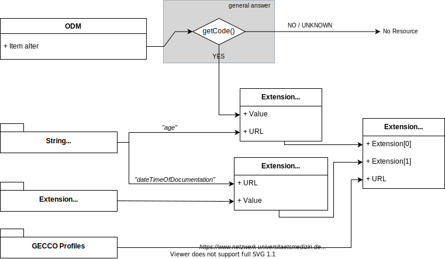

# ODM2FHIR Mappings

The following diagrams depict the mapping of study/patient data (items) in [CDISC ODM](https://www.cdisc.org/standards/data-exchange/odm) based on the [GECCO data dictionary](https://confluence.imi.med.fau.de/display/MIIC/30+EDC+System+REDCap) onto [HL7 FHIR](https://www.hl7.org/fhir) (resources) adhering to the [GECCO implementation guide](https://simplifier.net/ForschungsnetzCovid-19).

For static items the respective `ValueSet`, `CodeSystem` or `Extension` is shown along with the actually used value.

## Patient

## Anamnesis

### Cardiovascular Diseases

### Chronic Kidney Diseases

### Chronic Liver Diseases

### Chronic Lung Diseases

### Chronic Neurological Mental Diseases

### DNR Order

### Diabetes Mellitus

### Gastrointestinal Ulcers

### HIV Infection

### History of Travel

### Immunization Status

### Malignant Neoplastic Diseases

### Organ Recipient

### Respiratory Therapies

### Rheumatological Immunological Diseases

### Smoking Status

## Complications

### Complication Conditions

## Demographics

### Age

### Biological Sex

### Body Height

### Body Weight

### Ethnic Group

### Frailty Score

### Pregnancy Status

## Epidemiological Factors

### Known Exposure

## Imaging

### Imaging Procedures

## Laboratory Values

### Laboratory Values

### SARS CoV2 Antibodies

### SARS CoV2 RTPCR

## Medication

### ACE Inhibitors

### Anticoagulants

### COVID-19 Therapy

### Immunoglobulins

## Onset of Illness

### Stage at Diagnosis

## Outcome at Discharge

### Follow-Up SwabResult

### Respiratoric Outcome

### Type of Discharge

## Study Enrollment

### Interventional Studies Participation

### Study Enrollment COVID-19

## Symptoms

### Symptom Conditions

## Therapy

### Apheresis

### Dialysis Hemofiltration

### ECMO

### Patient in ICU

### Prone Position

### Ventilation Type

## Vital Signs

### Blood Pressure

### Body Temperature

### FiO2

### Heart Rate

### PH Value

### PaCO2

### PaO2

### Peripheral Oxygen Saturation

### Respiratory Rate

### SOFA Score
